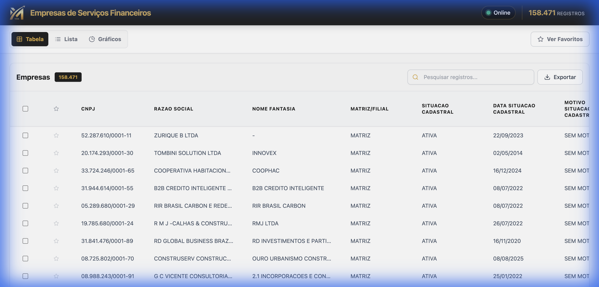
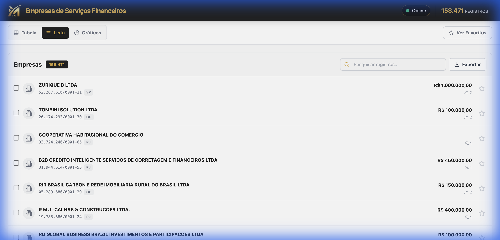
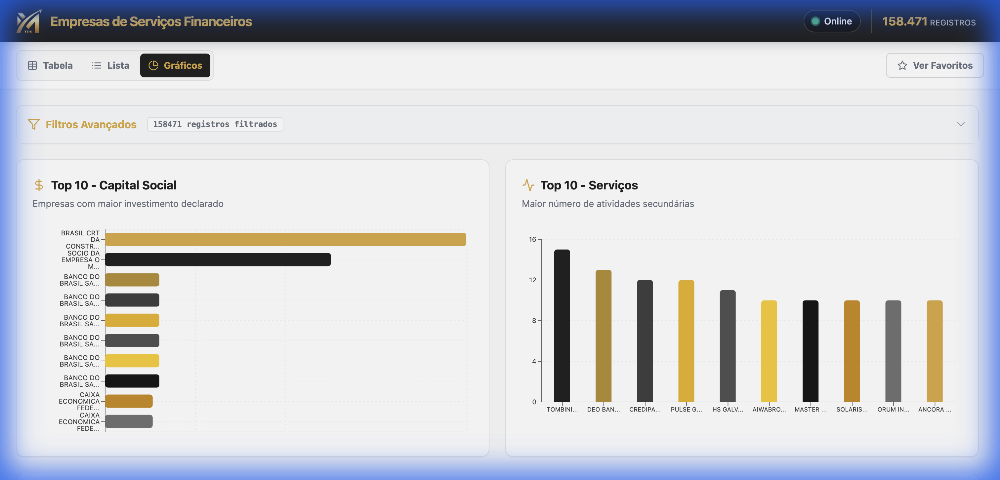

# Análise de Serviços Financeiros

Este é um painel interativo (dashboard) desenvolvido para facilitar a análise de empresas de serviços financeiros. A aplicação oferece uma interface moderna e intuitiva para visualizar, filtrar e comparar dados de diversas empresas do setor.

## 🎯 Finalidade
O objetivo principal deste aplicativo é fornecer uma visão clara e detalhada sobre o mercado de serviços financeiros, permitindo que o usuário explore indicadores, compare instituições e acompanhe empresas de interesse através de um sistema de favoritos.

## ✨ Funcionalidades

*   **Dashboard Visual**: Visão geral com métricas importantes e indicadores de status.
*   **Múltiplas Visualizações**:
    *   **Tabela**: Para análise detalhada de dados brutos.
    *   **Lista**: Para uma visualização mais resumida e rápida.
    *   **Gráficos**: Visualização analítica para identificar tendências e distribuições.
*   **Comparador de Empresas**: Ferramenta dedicada para comparar lado a lado os dados de diferentes instituições.
*   **Sistema de Favoritos**: Marque empresas importantes para acesso rápido e filtragem exclusiva.
*   **Ficha da Empresa**: Detalhes completos de cada instituição em um modal acessível.
*   **Responsividade**: Interface adaptada para funcionar bem em desktops e dispositivos móveis.

## 🚀 Como baixar e usar

Siga os passos abaixo para rodar o projeto localmente em sua máquina.

### Pré-requisitos
Certifique-se de ter o **Node.js** instalado em seu computador.

### Instalação

1.  Clone este repositório ou baixe os arquivos.
2.  Abra o terminal na pasta do projeto.
3.  Instale as dependências:

```bash
npm install
```

### Rodando a aplicação

Para iniciar o servidor de desenvolvimento, execute:

```bash
npm run dev
```

O terminal irá exibir o endereço local (geralmente `http://localhost:3000` ou `http://localhost:5173`). Abra este endereço no seu navegador para utilizar o app.

## 📸 Telas da Aplicação

### Visão Geral (Dashboard)


### Visualização em Lista


### Análise Gráfica


---
Desenvolvido com React, TypeScript e Vite.
